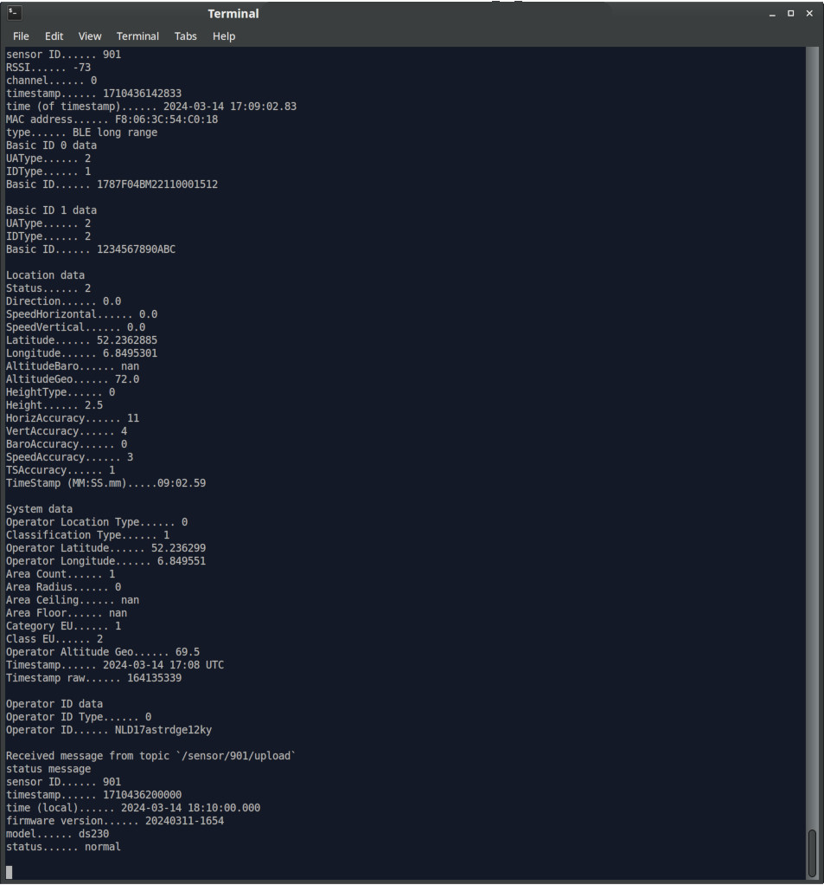
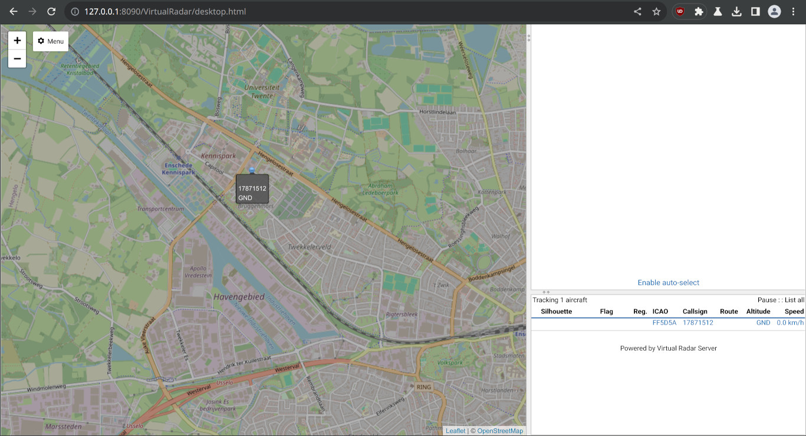
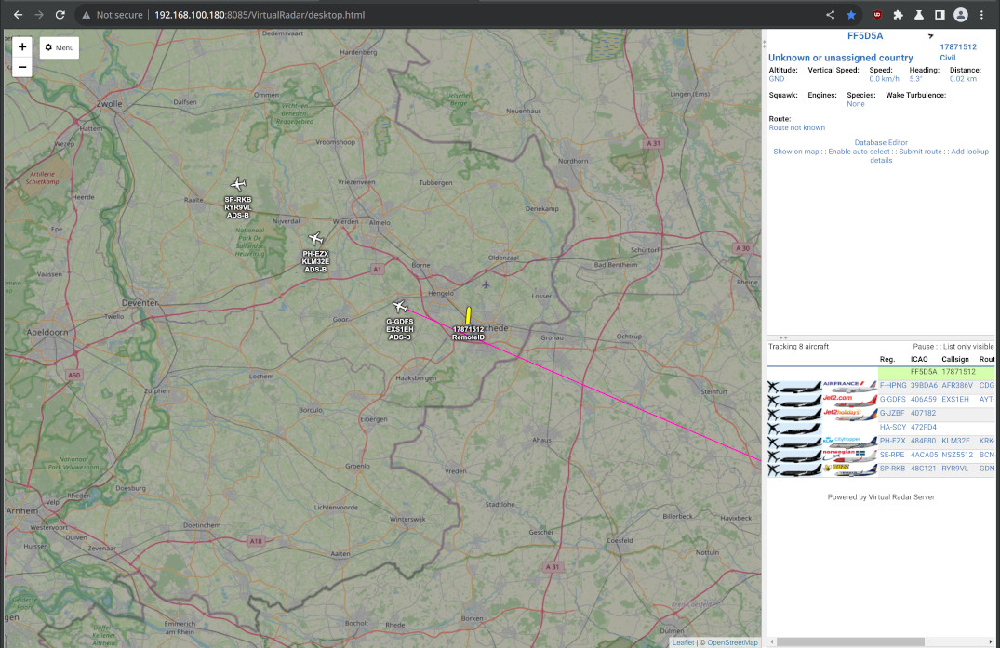

# RemoteID-MQTT-subscriber

## What is it?
This repository contains reference code to subscribe to a MQTT broker and parse data from DroneScout receivers (such as ds230, ds240 or DroneScout SDK). These receivers can be purchased at [https://dronescout.co/](https://dronescout.co/) The manual can be found here: [manual](https://download.bluemark.io/ds230.pdf)

DroneScout receivers detect broadcast/direct drone Remote ID signals (Bluetooth, WLAN); a <em>"wireless number plate"</em> technology that is or becomes mandatory in several parts of the world e.g. USA, EU, Japan. It supports all frequency bands (2.4 and 5 GHz) and transmission protocols (WLAN Beacon, WLAN NaN, Bluetooth 4 Legacy, Bluetooth 5 Long Range.)

\#RemoteID \#FAA \#F3411 \#dronetechnology \#DIN_EN_4709-002

## Installation
The code is Python3 code. It needs these dependencies (tested under Ubuntu):

```
sudo pip3 install paho-mqtt bitstruct pytz
```

## Configuration
DroneScout receivers output data using [MQTT](https://en.wikipedia.org/wiki/MQTT). MQTT is a sensor protocol that consists of publishers, subscribers and a broker. DroneScout receivers are a MQTT publisher. You need a MQTT broker where the sensors output their sensor data. This script is a MQTT subscriber.

In the config.py file, enter the correct settings for the ``broker``, ``port``. Leave the ``topic`` to "#" to recieve messages from all topics. Also add an ``username`` and ``password`` if your MQTT broker needs it.

It is also strongly advised to use secure SSL connection to the MQTT broker (``port`` 8883). For that also set the client_pem file. In case of non-SSL connections, use the ``port`` 1883.

If you want to log the detected Remote ID signals to a CSV file, please uncomment the ``log_path`` variable.

To disable printing of RemoteID message on the console uncomment ``print_messages`` variable and set it to False

The subscriber also allows exporting the detections via [SBS BaseStation](http://woodair.net/sbs/article/barebones42_socket_data.htm). See section SBS BaseStation.

## Usage
Start the script to receive and show Remote ID signals of nearby drones.

```
python3 mqtt_sub.py
```



### SBS BaseStation
The subscriber code can output data via [SBS BaseStation](http://woodair.net/sbs/article/barebones42_socket_data.htm) on a net socket. To enable this, uncomment the variables sbs_``server_ip_address`` and ``sbs_server_port`` in config.py. Normally you only need to change the port. The IP address needs to be an IP address of the computer where this script runs. Only change it, if you want to have the SBS BaseStation export available on a particular network interface.

This export data format is used by programs that display ADS-B data from airplanes. Examples of such programs that support this data format are: [Virtual Radar Server](https://www.virtualradarserver.co.uk/) and [FlightAirMap](https://www.flightairmap.com/). A typical use case is, if you want to view both ADS-B data from airplanes and RemoteID signals from drones in one application. To configure a SBS BaseStation receiver in Virtual Radar Server, see this [link](https://www.virtualradarserver.co.uk/Documentation/WebServer/ReceiversOptions.aspx)

Note: for exporting data, the normal Serial Number of RemoteID is too long. It is decided in this implementation to use an ICAO code starting with FF. This range is **not** assigned to a country. The remaining 4-digits in the ICAO code are based on the Serial Number of the drone (hash). In this way, each drone has its own unique ICAO code. The 8-character call sign is based on the first 4 digits of the Serial Number (manufacturer code) and the last 4 digits.




